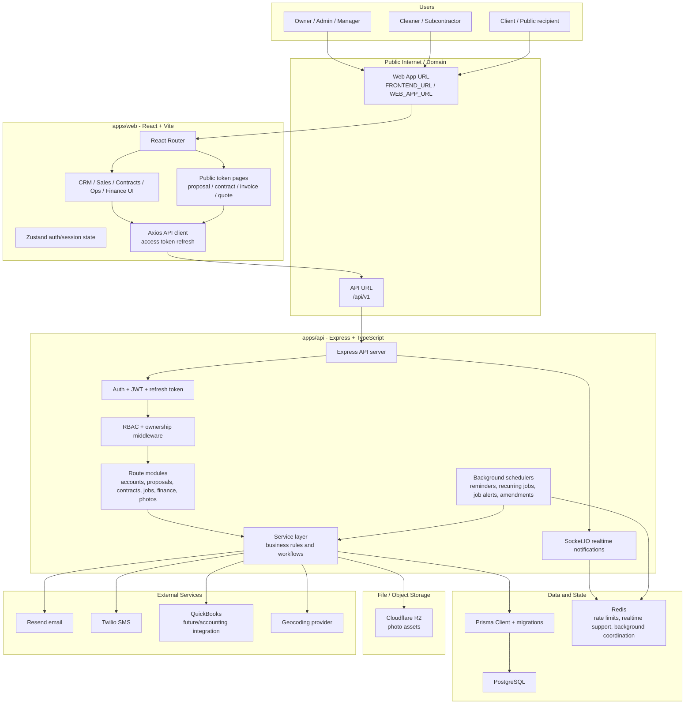
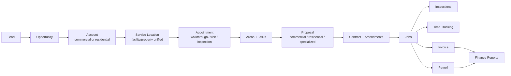
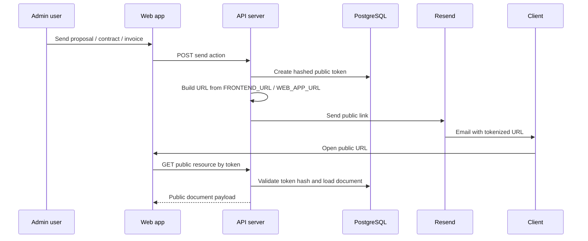
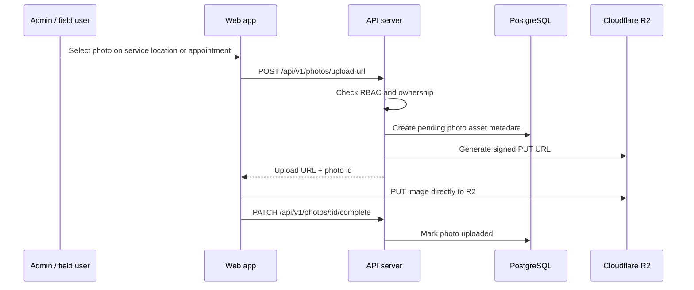

# Hygieia Architecture Diagram

This diagram reflects the current Hygieia architecture: a React web app, Express API, PostgreSQL/Prisma data layer, Redis-backed realtime/background support, public client links, and external services.

## Deployment View

## Application Module Flow

## Public Link Flow

## Photo Upload Flow

## Runtime Responsibilities

| Layer | Responsibility |
| --- | --- |
| Web app | Authenticated UI, public document views, client-side routing, API calls |
| API app | Authentication, RBAC, ownership checks, workflows, public token validation |
| Services | Business logic for CRM, proposals, contracts, jobs, inspections, finance, photos |
| Prisma/PostgreSQL | System of record for accounts, service locations, tasks, proposals, contracts, jobs, invoices, payroll |
| Redis | Rate limiting, realtime support, background coordination |
| Cloudflare R2 | Object storage for service-location and appointment photos |
| Email/SMS | Client documents, reminders, verification, operational notifications |

## Deployment Notes

- `FRONTEND_URL` and `WEB_APP_URL` control generated public links.
- `VITE_API_BASE_URL` controls where the web app sends API requests when the API is on a separate domain.
- `CORS_ORIGIN` must include the deployed web domain.
- R2 uses account-level endpoint plus bucket name, not a bucket path in the endpoint.
- Background schedulers currently run from the API process.
